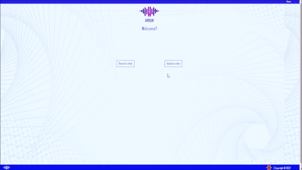

# Arkun
## An Effective and Personalized way to present your ideas across
> Arkun is an effortless way to create personalized advertisement.
> Helps to grasp customer interest with a customised video message
> by adapting videos with a speaking face for a specific text message




## Installation

### Requirements

0. Update and Upgrade
```sh
sudo apt update
sudo apt upgrade
```
2. Docker: 20.10.13
```sh
sudo apt install docker.io
sudo snap install docker
docker --version
```
2. Docker-compose: v2.3.3
```sh
sudo apt install docker-compose-plugin
docker compose version
```
3. Python: 3.8.0
```sh
sudo apt install python3
sudo apt python3-pip
```
4. Git: 
```sh
sudo apt install git
```

## Development setup
0. Clone and change the Directory to ./arkun
```sh
git clone https://github.com/satyakisolutions/arkun.git
cd arkun/
```
1. First time Setup, Build and run the project
```sh
docker-compose up --build
```
2. Just to Run
```sh
docker-compose up
```
3. Just to Build
```sh
docker-compose build
```
4. To stop the running project
```sh
docker-compose down
```

## Release History

* 0.1.0
    * The first proper release
* 0.0.1
    * Work in progress


## Contributing

1. Fork it (<https://github.com/yourname/yourproject/fork>)
2. Create your feature branch (`git checkout -b main/arkun`)
3. Commit your changes (`git commit -am 'Add some fooBar'`)
4. Push to the branch (`git push origin main/arkun`)
5. Create a new Pull Request

### Authors and References
> Wav2lip
> > https://github.com/Rudrabha/Wav2Lip

> Satyaki Solutions
> > https://github.com/satyakisolutions
